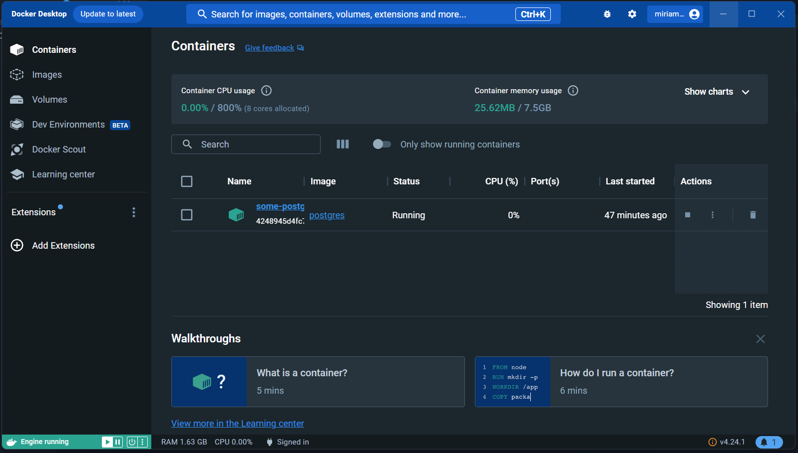
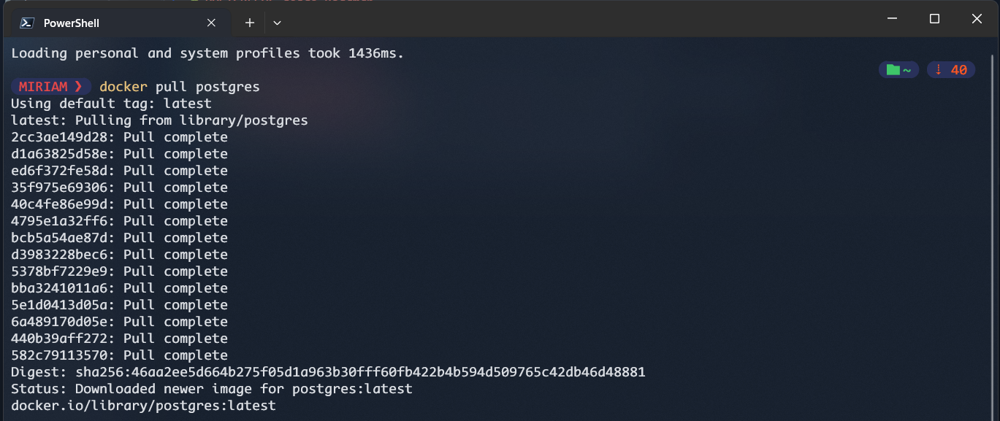
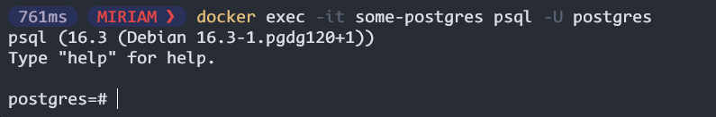

# POSTGRESQL desde Roadmap

Podemos generar una imagen mediante Docker y aquí les doy un ejemplo.

#### PostgreSQL con Docker
1. Tener instalado Docker, una cuenta en DockerHub, iniciar sesión e iniciar Cocker

2. Escribir el siguiente comando en Terminal `docker pull postgres`

3. Ahora crearemos un usuaio y contraseña para acceder a Postgres

4. Ahora ejecutamos por el nombre y usuario
